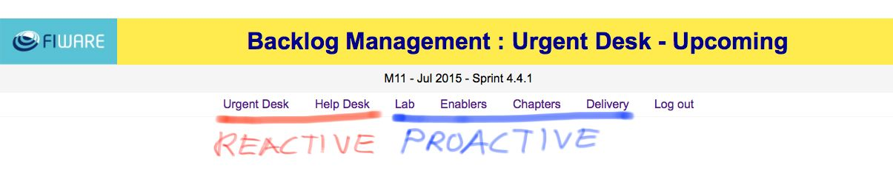

.. _backlog:

Backlog
=======

The backlog management web site is a tool implemented with the purpose to provide easy understanding of the activity
recorded on the trackers, see :ref:`jira_trackers`.

The backlog web site is available at http://backlog.fiware.org

.. figure:: _static/backlogsite_login.jpg
   :align: center

The backlog management web site has been structured thinking of the reactive and proactive work modes needed.

For the reactive mode it holds the :ref:`urgent_desk`, which takes advantage of issues' deadlines and priority fields to focus and encourage action,
and the :ref:`help_desk`, which holds specific views and graphs to monitor our reaction time.

To organise our work proactively according to the corresponding road maps:

* The :ref:`backlog_chapters` and :ref:`backlog_enablers` help organising development work of the Enablers.
* The :ref:`backlog_lab` is focused on the maintenance and service work of FIWARE Lab Nodes.
* And finally, :ref:`backlog_delivery` focuses on holding views to produce due deliverables for the EC.

.. _backlog_chapters:

Chapters
--------

::

    TO BE PROVIDED

.. _backlog_enablers:

Enablers
--------

::

    TO BE PROVIDED

.. _backlog_lab:

Lab
---

::

    TO BE PROVIDED

.. _backlog_delivery:

Delivery
--------

::

    TO BE PROVIDED
