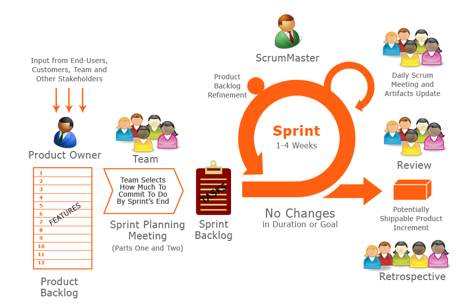

.. _foundation:

Foundation
==========

AGILE Concept
-------------
At FIWARE we adopted AGILE in order to overcome specific drawbacks identified in traditional methodologies.

`The Agile Manifesto <http://www.agilemanifesto.org>`_ focuses on 4 important values.

It sets preference for **Agile** values over other **Traditional** ones:

============================    ===========================
Agile Value                     Traditional Value
============================    ===========================
Individuals and Interactions    Processes and Tools
Working software                Comprehensive Documentation
Customer collaboration          Contract Negotiation
Responding to change            Following a Plan
============================    ===========================

That is, while there is value in the items on the right, we value the items on the left more.

Behind the agile manifesto there are `The Agile Principles <http://www.agilemanifesto.org/principles.html>`_

The twelve principles of Agile:

#. Our highest priority is to satisfy the customer through early and continuous delivery of valuable software.

#. Welcome changing requirements, even late in development. Agile processes harness change for  the customer's competitive advantage.

#. Deliver working software frequently, from a couple of weeks to a couple of months, with a preference to the shorter timescale.

#. Business people and developers must work together daily throughout the project.

#. Build projects around motivated individuals. Give them the environment and support they need, and trust them to get the job done.

#. The most efficient and effective method of conveying information to and within a development team is face-to-face conversation.

#. Working software is the primary measure of progress.

#. Agile processes promote sustainable development. The sponsors, developers, and users should be able to maintain a constant pace indefinitely.

#. Continuous attention to technical excellence and good design enhances agility.

#. Simplicity--the art of maximizing the amount of work not done--is essential.

#. The best architectures, requirements, and designs emerge from self-organizing teams.

#. At regular intervals, the team reflects on how to become more effective, then tunes and adjusts its behavior accordingly.

There are various methodologies collectively known as AGILE, as they promote the values of the agile manifesto
and they are consistent with the above principles.

Have a look at the `Agile methods in Wikipedia <https://en.wikipedia.org/wiki/Agile_software_development#Agile_methods>`_

SCRUM Framework
---------------
At FIWARE we adopted the SCRUM framework which concentrates particularly on how to manage tasks within a
team-based development environment.

Scrum begins when customers need a product.
The Scrum framework guides the creation of that product, with a focus on value and high visibility of progress.
Working from a dynamic list of the most valuable things to do, and using the Scrum framework,
a Scrum team brings that product from an idea to life.
The Scrum framework is consistent across products and that is what makes it so useful.
You don’t have to modify the framework depending on the product; you use one across all.

Scrum is inspired in empirical inspect and adapt feedback loops to cope with complexity and risk.
Scrum emphasizes decision making from real-world results rather than speculation.
Scrum split time into short work slots, known as sprints, four weeks in FIWARE.
The product is properly integrated and tested.
At the end of each sprint, stakeholders and team members meet to see a demonstrated increment and plan its next steps.

Scrum is a simple set of roles, artifacts, and meetings working together in a defined process.
By removing unnecessary unpredictability, we’re better able to cope with the unavoidable unpredictability of continuous
discovery and learning.

**Scrum roles**
    * *Product Owner* -- holds the vision of the product
    * *Scrum Master* -- helps the team best use Scrum to build the product
    * *Development Team* -- builds the product

**Scrum artifacts**
    * *Product increment* -- an integrated, shippable subset of the product
    * *Product backlog* -- the list of ideas for the product, in order of priority
    * *Sprint backlog* -- the detailed plan for development during the next sprint

The team displays its plans and progress so that all team members and stakeholders can always see what the team is accomplishing.

**Scrum activities**
    * Product backlog refinement
    * Sprint planning
    * Daily Scrum
    * Sprint Review
    * Sprint Retrospective

Scrum roles, artifacts, and activities work together within a Scrum cycle.

Roles
^^^^^

**Product Owner**:
    The product owner is the member of the Scrum team charged with maximizing the value of the team’s work.
    The product owner holds the product vision and works closely with stakeholders, such as end users, customers, and
    the business to cultivate and nurture a community around the product. They facilitate communication between
    the team and the stakeholders and ensure the team is building the right product. They describe what
    should be built and why, but not how.

**Developement Team**:
    The development team does the actual work of delivering the product increment.
    The team is a cross-functional group of professionals who, among them, have all the necessary skills to deliver
    each increment of the product. All team members should be available to the team and the project full time

**Stakeholders**:
    It refers to any other people interested in the product such as such as end users, customers, partners, sponsors, etc.

**Scrum Master**:
    The ScrumMaster is a servant leader, helping the rest of the Scrum team progress. The ScrumMaster
    keeps the Scrum team productive and learning. They must have a good understanding of the Scrum framework
    and the ability to train others to use it. The ScrumMaster has three core responsibilities:

    * Coach the team
    * Keep the team moving forward
    * Help everyone understand Scrum

Artifacts
^^^^^^^^^

**Product Backlog**:
    This is a list of ideas for the product, which can come from the product owner, team members, or stakeholders.
    The product backlog is ordered to maximize the value delivered by the Scrum team. The development team's work
    comes from the product backlog. Every feature, enhancement, bug fix, documentation requirement—every bit of work
    the team does—comes from a product backlog item.

**Sprint Backlog**:
    The sprint backlog is the list of refined product backlog items chosen for development in the current sprint,
    together with the team's plan for accomplishing the work. It reflects the team's forecast of what work can be
    completed. Once the sprint backlog is established, the development team begins work on the new product increment.

**Product Increment**:
    Every sprint produces a product increment, the most important Scrum artifact. A product increment is the "goal line"
    for each sprint and, at the end of the sprint, it must:

    * Be of high enough quality to be given to users
    * Meet the Scrum team's current definition of done
    * Be acceptable to the product owner

Activities
^^^^^^^^^^^
**Product Backlog Refinement**:
    Product backlog items are often large and general in nature, and they can come and go as priorities change.
    Because of this fluid environment, product backlog refinement is an ongoing activity throughout a Scrum project.
    When you refine the product backlog, you:

    * Confirm the order of the product backlog items
    * Remove or demote items that no longer seem important
    * Add ora promote items that come up or become more important
    * Split larger items into smaller items
    * Merge smaller items into larger items
    * Estimate items
    * Identify which items are sprint-ready

    Product backlog refinement is an excellent way to prepare for upcoming sprints.
    During this process, you give special attention to selecting items coming up for the next sprint.
    Things to consider include:

    * Each item for the sprint should represent an increment of "business value."
    * The development team needs to be able to build each item within a single sprint.
    * Both the stakeholders and the entire Scrum team need to be clear on what is intended.
    * Depending on the nature of the product, other skills and inputs may be needed.

    That's why product backlog refinement is really a responsibility of all team members, not just the product owner.

**Sprint Planning**:
    Each sprint begins with a time boxed meeting called sprint planning.
    In this meeting, the Scrum team selects and understands the work to be done in the sprint.

    The entire team attends the sprint planning meeting. Working from the product backlog, the product owner and the
    development team members discuss each item and come to a shared understanding of that item and what is required to
    complete it consistent with the current definition of done. The recommended time for the sprint planning meeting is
    two hours or less per week of sprint duration. Because the meeting is time boxed, the success of the sprint
    planning meeting depends on the quality of the product backlog going in. This is why product backlog refinement
    is so important.

    In Scrum, the sprint planning meeting has two outcomes:

    #. A forecast of what work will be completed in the sprint
    #. A plan for accomplishing the work

    *A forecast of what work will be completed in the sprint*
        The product owner, who decides what to do, presents ordered product backlog items to the development team, and
        the whole Scrum team collaborates to review and understand the work.

        The number of product backlog items to take on in the sprint is completely up to the development team.
        The team considers the current state of the product increment, the team’s past performance, its current capacity,
        and the ordered product backlog. Neither the product owner nor anyone else can add work onto the development team.
        Often, but not always, the sprint is given a specific and measurable shared goal, called the sprint goal.
        This goal, which summarizes why the sprint is happening, helps everyone focus on the essence of what needs to be done.

    *A plan for accomplishing the work*
        The development team then collaborates to decide how to produce the next product increment to the definition of done.
        They need to be confident of completing the work during the sprint. Work to be done in the early days is broken
        down into small units of one day or less. Work to be done later may be left in larger units to be broken down later.

    The product owner is available during this part of the meeting to answer questions and resolve misunderstandings
    but has no part in determining how the work gets done.

    *Result of sprint planning*
        At the end of sprint planning, the Scrum team has a common understanding of the quantity and complexity of work
        to be accomplished during the sprint and can, within a reasonable range of circumstances, expect to complete it.
        The team then commits to each other to accomplish it.

    To sum up the sprint planning meeting:

    The product owner decides what to do
    Presents "what to do," using the product backlog items
    Answers questions and resolves misunderstandings about the product backlog items

    The development team decides how much to take on and how to accomplish it
    Considers and discusses product backlog items with the product owner
    Ensures a common understanding of them
    Selects a number of items they forecast they can accomplish
    Creates a sufficiently detailed plan to be sure they can accomplish the items

    The resulting list of things to do is the "sprint backlog."

**Daily Scrum**:
    The development team uses the Daily Scrum meeting to ensure that they are on track for that sprint.
    They hold the meeting at the same time and place every day.
    The meeting should be short and time boxed for a maximum of 15 minutes.
    During the meeting, each development team member gives three bits of information:

    What he or she has accomplished since the last Daily Scrum
    What he or she plans to accomplish between now and the next Daily Scrum
    What is impeding progress
    Team members might ask brief clarifying questions and get brief answers, but they don't go into depth
    during the Daily Scrum. Instead, subsets of the development team often meet right after the Daily Scrum
    to work on any issues that have come up.

    The Daily Scrum is not a reporting event. It's a communication meeting within the development team that helps
    ensure that all team members are on the same page and moving forward. Though interested parties are welcome
    to come and listen to the Daily Scrum, only the Scrum team members, including the ScrumMaster and product owner,
    speak during this meeting. Based on what comes up in the meeting, the development team reorganizes the work as
    needed to accomplish the sprint goal, if one has been established, and the product increment.

    The Daily Scrum leads to transparency, trust, and better performance.
    How? The daily check-in provides immediate recognition and resolution of problems and promotes
    the team's self-organization and self-reliance.

**Sprint Review**:
    At the end of each sprint, the Scrum team and stakeholders review the resulting product increment.
    This meeting is called a sprint review

    The main point of discussion is the product increment completed during the sprint.
    Since the stakeholders are those who have a "stake" in the results, it's a good idea, and helpful too,
    for them to attend this meeting. During the meeting, the team members look at where they are and collaborate
    on how they might move forward. Everyone has input at the sprint review.

    Teams will find their own way to conduct the sprint review. Some common components of the meeting include:

    * An overview of the product increment
    * A demonstration of the product increment
    * An update of the product backlog

**Sprint Retrospective**:
    At the end of each sprint, the Scrum team produces the sprint retrospective. During the sprint retrospective,
    the team members review how the process went, including the intrapersonal relationships and the tools used.
    They talk about what went well and not so well, and they identify potential improvements.
    Then they come up with a plan for improving those things in the future.
    Remaining true to the Scrum framework, the Scrum team improves its own process versus relying on others to provide
    direction.

