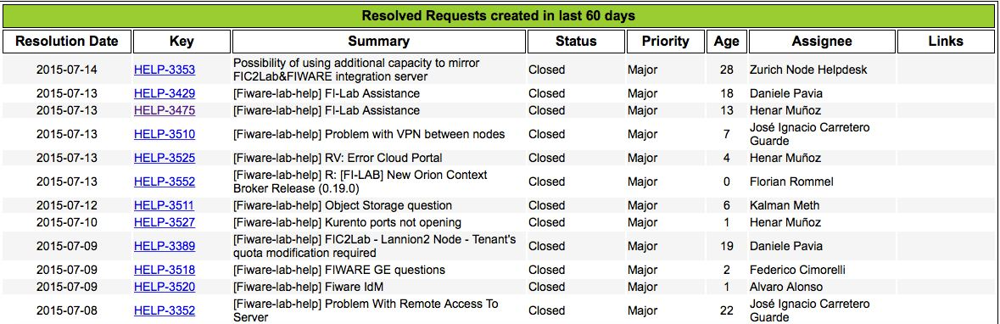
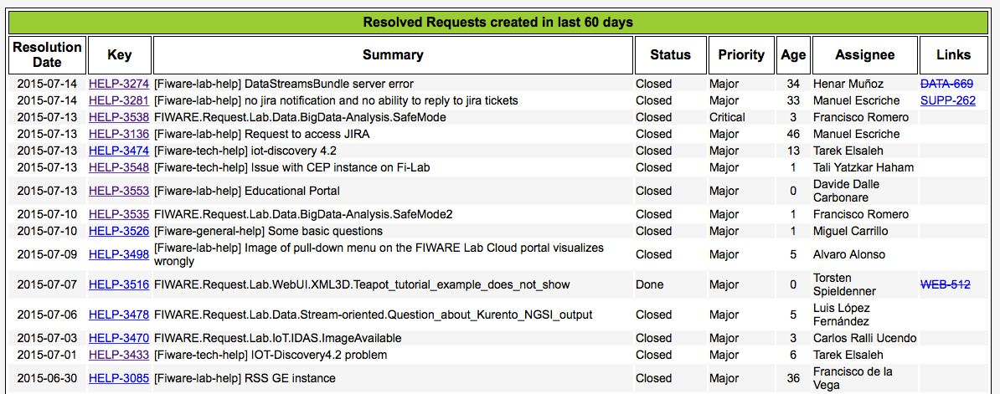

.. _help_desk:

Help Desk
=========

The Help Desk is an operative tool used to provide support to FIWARE Lab Users mainly,
although it includes channels for marketing as well, such as Speakers, Mundus, etc.

The complete set of channels is available at https://www.fiware.org/contact-us/.

FIWARE's Help Desk has been built by connecting three tools: Email lists, JIRA trackers and Backlog web site.
All incoming emails are feeding the `HelpDesk Tracker <https://jira.fiware.org/projects/HELP>`_ where they are classified
to their corresponding JIRA holder components and assigned for its resolution.

+---------------------------+--------------------------+--------------------------------+
| Email Channel             | JIRA Component           | Leader                         |
+===========================+==========================+================================+
| fiware-general-help       | `GENERAL-HELP`_          | FF - Stefano de Panfilis       |
+---------------------------+--------------------------+--------------------------------+
| fiware-speakers-req       | `SPEAKERS-REQ`_          | OGILVY - Ángeles Tejado        |
+---------------------------+--------------------------+--------------------------------+
| fiware-tech-help          | `TECH-HELP`_             | FF - Fernando López            |
+---------------------------+--------------------------+--------------------------------+
| fiware-training-req       | `TRAINING-REQ`_          | OGILVY - Ángeles Tejado        |
+---------------------------+--------------------------+--------------------------------+
| fiware-lab-help           | `LAB-HELP`_              | ENG - Alfonso PietroPaolo      |
+---------------------------+--------------------------+--------------------------------+
| fiware-collaboration-req  | `COLLABORATION-REQ`_     | FF - Juanjo Hierro             |
+---------------------------+--------------------------+--------------------------------+
| fiware-mundus-req         | `MUNDUS-REQ`_            | INTERINNOV - Geraldine Quetin  |
+---------------------------+--------------------------+--------------------------------+

The help desk has also a dedicated section for the accelerators: :ref:`coaches_helpdesk`

.. _GENERAL-HELP: https://jira.fiware.org/secure/IssueNavigator.jspa?reset=true&jqlQuery=project+%3D+HELP+AND+component+%3D+FIWARE-GENERAL-HELP
.. _SPEAKERS-REQ: https://jira.fiware.org/secure/IssueNavigator.jspa?reset=true&jqlQuery=project+%3D+HELP+AND+component+%3D+FIWARE-SPEAKERS-REQ
.. _TECH-HELP: https://jira.fiware.org/secure/IssueNavigator.jspa?reset=true&jqlQuery=project+%3D+HELP+AND+component+%3D+FIWARE-TECH-HELP
.. _TRAINING-REQ: https://jira.fiware.org/browse/HELP-6248?jql=project%20%3D%20HELP%20AND%20component%20%3D%20FIWARE-TRAINING-REQ
.. _LAB-HELP: https://jira.fiware.org/secure/IssueNavigator.jspa?reset=true&jqlQuery=project+%3D+HELP+AND+component+%3D+FIWARE-LAB-HELP
.. _COLLABORATION-REQ: https://jira.fiware.org/secure/IssueNavigator.jspa?reset=true&jqlQuery=project+%3D+HELP+AND+component+%3D+FIWARE-COLLABORATION-REQ
.. _MUNDUS-REQ: https://jira.fiware.org/secure/IssueNavigator.jspa?reset=true&jqlQuery=project+%3D+HELP+AND+component+%3D+FIWARE-MUNDUS-REQ

.. _main_helpdesk:

Main Help Desk
--------------

The main help desk view is provided at http://backlog.fiware.org/helpdesk/

A summary view of the help desk is provided with statistics and two graphs shown in the snapshot below.

Three data set are considered to give statistics parameters about: mean, median, standard deviation

* ALL data set, in black colour
* Created in last 60 days, in green colour
* Pending, in red colour

   Main Help Desk - Summary View

Additionally, each channel has it own statistics at http://backlog.fiware.org/helpdesk/main/stats.

As an example an snapshot about the General Help Channel is shown below:

   General Help Channel - Summary View

Although incoming issues arrive from different email list,
the issue's solver has to allocate it to their right channel by hand.

Lab Channel View
^^^^^^^^^^^^^^^^
There's a public url providing this view at http://backlog.fiware.org/helpdesk/lab

A summary view of the channel is provided with the statistics and graphs.
After identifying the channel, the first three rows provide statistics
for ALL items in the channel (black color), for issues created in last 60 days (green color), and for unresolved issues (red color)

Afterwards, the graph to the left shows evolution in time for created and resolved issues. Emphasizing with a column monthly progress.
The graph to the right displays an histogram with the resolution time for ALL resolved issues and for recent resolved issues (last 60 days).
And it also includes age of unresolved issues.

Additionally, a list of all unresolved issues is provided so that both users and help desk operators can share the same information.

Finally, a list of recenly resolved issues is shown in order to allow their verfication.

Tech Channel View
^^^^^^^^^^^^^^^^^^
There's a public url providing this view at http://backlog.fiware.org/helpdesk/tech

This page follows the same pattern as the Lab Channel View.
A summary view of the channel is provided with the statistics and graphs.
After identifying the channel, the first three rows provide statistics
for ALL items in the channel (black color), for issues created in last 60 days (green color), and for unresolved issues (red color)

Afterwards, the graph to the left shows evolution in time for created and resolved issues. Emphasizing with a column monthly progress.
The graph to the right displays an histogram with the resolution time for ALL resolved issues and for recent resolved issues (last 60 days).
And it also includes age of unresolved issues.

Additionally, a list of all unresolved issues is provided so that both users and help desk operators can share the same information.

Finally, a list of recenly resolved issues is shown in order to allow their verfication.

Enabler Help Desk
^^^^^^^^^^^^^^^^^

GE Owners contribute to support their GEs deployed in FIWARE Lab by answering related questions or by fixing bugs.
In order to help them have better understanding of their related issues and response, a focused view is displayed.

To access it, go to Enablers, then pick up an enabler, and click on Help Desk item in the second menu bar

.. figure:: _static/helpdesk_tech_enabler_menu.jpg
   :align: center

   Menu sequence to access the enabler's help desk page

The enabler help desk page identifies first the enabler: name, owner, ... and its keyword.
Then, the Inbox is displayed with all items collected in the help desk for this GE Owner.
These items are proposed because they can not be filtered properly until its name is fixed.

Therefore, you need to modify its name according to the pattern below to move it from the Inbox to the Enabler Help Desk Box::

    FIWARE.Request.Lab.<Chapter>.<Enabler>.<Item>

Additionally, sometimes issues came from the wrong channel, and there's need to fix it as well.

* Make sure the issues' component is TECH-HELP

When writting <item>, please, take into account:

* It should be short but meaningful.
* Avoid redundancy, like repeating FIWARE, or Lab

   Enabler's help desk page

.. _coaches_helpdesk:

Coaches Help Desk
-----------------

FIWARE Help Desk has a section devoted to support accelerators.
This help desk is composed by channels following similar structure to the main helpdesk.
Each channel has its corresponding coach responsible for attending incoming request.

+----------------------------------+--------------------------+--------------------------------+
| Email Channel                    | JIRA Component           | Leader                         |
+==================================+==========================+================================+
| fiware-coaching                  | `FIWARE-COACHING`_       | FF - Fernando López            |
+----------------------------------+--------------------------+--------------------------------+

.. _FIWARE-COACHING: https://jira.fiware.org/issues/?jql=project%20%3D%20HELC%20AND%20component%20%3D%20FIWARE-Coaching

   Coaches help desk - Summary view

This help desk section has also fresh input about incoming and resolved issues:

   Coaches help desk - Unresolved Issues

   Coaches help desk - Resolved Issues

And there are summary views for all coaches help desk channels to understand their evolution:

   Coaches help desk channel - Summary View

These views are available at http://backlog.fiware.org/helpdesk/coaches/stats

Relationship with Main Help Desk
^^^^^^^^^^^^^^^^^^^^^^^^^^^^^^^^

As stated above each accelerator has its own coach to give specific support.
However sometimes the requests received by the coaches are either specific to the node the accelerator is working on
or to the Generic Enabler the accelerator is working with. In these cases the coach doesn't answer the question himself
but to assign it to the corresponding GE Owner or Node support Team.

Assignment to GE owners can be done directly on the coaches help desk but this cannot be done for the nodes. In this case
the issue is cloned to the help desk and assigned to the node support team there.

   Coaches help desk - Relationship with Main help desk

#. FIWARE developer sends a request to the coaches help desk
#. The coach provides support, assigns it to a GE owner or redirects it to the main help desk
#. The coach redirects the issue to the main help desk by clonning it ( :ref:`jira_issue_clone` ).
   Once in the main help desk it'll be assigned to the corresponding node support team (LAB channel)
#. The Node support team provides support in the :ref:`main_helpdesk`
#. The GE Owner (TECH channel) provides support in the :ref:`coaches_helpdesk`

If the coaches assess the issue was sent to the wrong help desk, he simply :ref:`jira_issue_move` to the main help desk