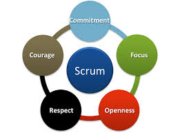
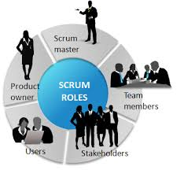
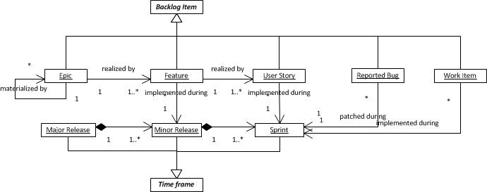
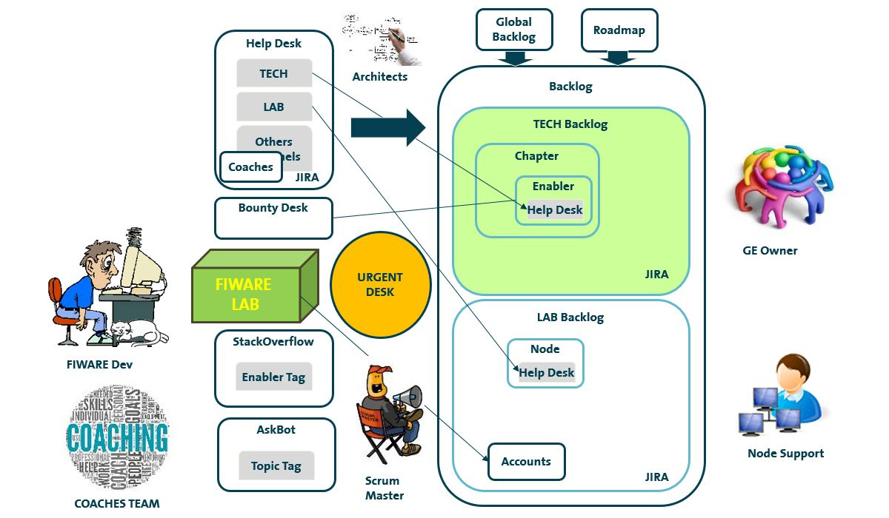
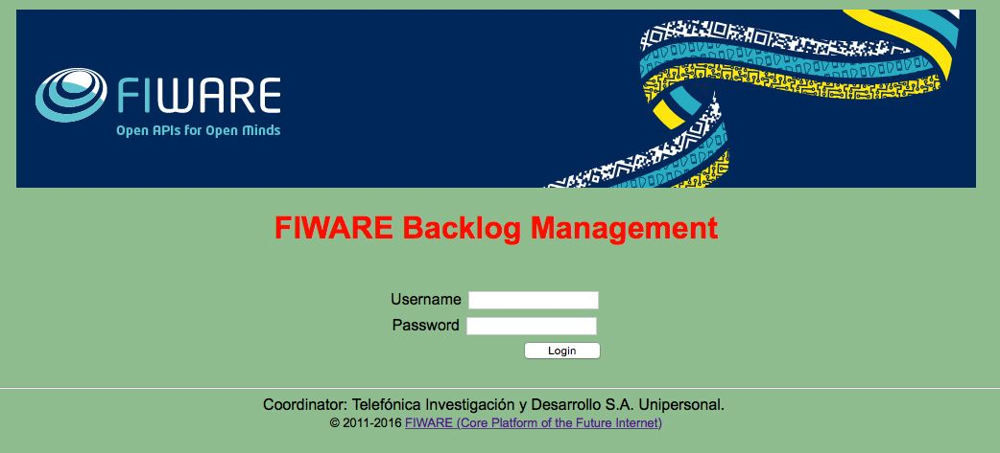
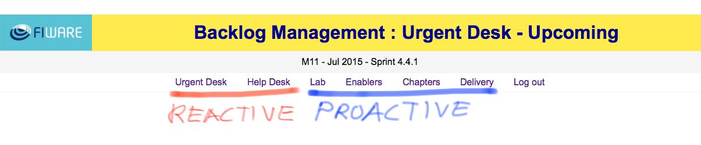

Introduction
================

FIWARE follows the AGILE principles and an adapted SCRUM Framework for Large Projects, see :ref:`foundation`

FIWARE has paid attention to these methods because they promote:

* A project management process focused on adaptability to change
* A leadership philosophy that stimulates team work, self-management and responsibility
* A set of best practices that allow quick delivery of high quality software
* Synchronisation between software development and customer needs

The use of an AGILE development approach gives FI-CORE dynamism in order to implement and test new requirements
coming from different stakeholders and in particular from FI-PPP phase 3 projects.
In this way, matching market needs with technological implementation is ensured in a swifter and more effective way.

FIWARE uses SCRUM as the reference framework for developing and sustaining software on work packages and task levels.
SCRUM employs an iterative, incremental approach to optimize predictability and control risk.

Three pillars uphold every implementation of this empirical process control: Transparency, Inspection and Adaptation.

* **Transparency** allows visibility of relevant aspects of the process to those responsible for the outcome.
* **Inspection** allows users to inspect relevant artifacts in order to detect undesirable variances.
* **Adaptation** allows adjustment when one or more aspects of the process deviate outside acceptable limits.

   Scrum Values

SCRUM prescribes four formal opportunities for inspection, and adaptation: Sprint preparation and planning,
Follow-up meetings, Sprint Review and Sprint Retrospective.

SCRUM's artifacts represent work or value in various ways that are useful in providing transparency and opportunities
for inspection and adaptation. The product backlog is a key artifact showing an ordered list of features, functions,
requirements, enhancements and fixes needed in the product and is the single source of requirements for any changes to
be made to the product. The product owner is responsible for the product backlog.
The Sprint backlog is the set of Product Backlog items selected for the sprint plus a plan for delivering the product
increment. The Sprint Backlog makes visible all the work to be performed during the sprint.

FIWARE uses SCRUM to manage UC requirements as well as feedback obtained from experimentation. Chapter and task leaders
play the role of Chief Product Owners / Product Owners at architecture and component levels, respectively, interacting
with UC when necessary.

   Scrum roles

Interim software releases will be continuously integrated into the experimental environment freezing a version at
the end of each period as part of the overall integration activities.

FIWARE in order to address the backlog's scalability aspect inherent to a large-scale Integrated Project has taken
as reference some aspects to the development framework from `Dean Leffingwell <http://scalingsoftwareagility.files.wordpress.com/2007/03/a-lean-and-scalable-requirements-information-model-for-agile-enterprises-pdf.pdf>`_

FIWARE, in adopting an agile approach to software development, is following the succesful experience gained in FI-WARE
project where concrete adaptation of the development framework referred has been performed. FI-WARE has adapted the conceptual
model to its own vision and needs, has implemented its own extensible naming conventions for backlog items, and has evolved
specific tools so that backlogs are reliable, transparent, inspectionable and adaptable.

.. _backlog_model:

   Backlog Items Type Model

`Agile Approach at FIWARE <https://forge.fiware.org/plugins/mediawiki/wiki/fiware/index.php/FIWARE_Agile_Development_Methodology>`_

`FIWARE - Releases and Sprints <https://forge.fiware.org/plugins/mediawiki/wiki/fiware/index.php/Releases_and_Sprints_numbering,_with_mapping_to_calendar_dates>`_

FIWARE AGILE/SCRUM Tools
------------------------

.. _Backlog Web Site: http://backlog.fiware.org
.. _JIRA Web Site: http://jira.fiware.org

At FIWARE we are looking to be sensitive to several request sources.
Hence a number of tools are used to meet this purpose.
Being the `Backlog Web Site`_ and `JIRA Web Site`_ used to implement Desks and Backlogs.

   FIWARE Scrum Tools Overview

The backlog management web site is a tool implemented with the purpose to provide easy understanding of the activity
recorded on the trackers, see :ref:`jira_trackers` being they used for desks or backlogs.

Access to FIWARE Management Web Site at http://backlog.fiware.org

   FIWARE Backlog Management Web Site - Login page

At FIWARE we are looking to be sensitive to several sources demanding both reactive and proactive working modes.

Therefore the Backlog Management web site has been arranged accordingly:

For the reactive mode it holds the :ref:`urgent_desk`, which takes advantage of issues' deadlines and priority fields to focus and encourage action,
and the :ref:`help_desk`, which holds specific views and graphs to monitor our reaction time.

To organise our work proactively according to the corresponding road maps:

* The :ref:`backlog_lab` is focused on the maintenance and service work of FIWARE Lab Nodes.
* The :ref:`backlog_chapters` and :ref:`backlog_enablers` help organising development work of the Enablers.
* And finally, :ref:`backlog_delivery` focuses on holding views to produce due deliverables for the EC.

Urgent Desk
^^^^^^^^^^^
The :ref:`urgent_desk` is an important tool since it allows to create common awareness on issues with **time-sensitive fields**
such as issues' deadlines, priorities and status.
To meet this objective, it collects all items in the trackers with relevant deadlines, priorities and status to display them in the desk.

Help Desk
^^^^^^^^^

The :ref:`help_desk` is also a key tool in supporting the end users. It's implemented by adding email lists connected to JIRA.
The Backlog Web Site also helps by providing meaningful views for the different channels and actors.

* `Channels: Email <https://www.fiware.org/contact-us/>`_
    Each channel has its corresponding view in the tracker and backlog web site. Two key channels from the technical
    point of view are:

    * `fiware-lab-help <http://backlog.fiware.org/helpdesk/lab>`_  help desk view of the channel devoted to incoming issues to be solved in FIWARE LAB
    * `fiware-tech-help <http://backlog.fiware.org/helpdesk/tech>`_ help desk view of the channel devoted to incoming issues to be solved in Generic Enabler Implementations

Backlog
^^^^^^^

The :ref:`backlog`, which is a central key element in the SCRUM Framework, is implemented by means of two tools:

* `Tracker: JIRA <http://jira.fiware.org>`_
    It operates as a tracker, recording issues, their descriptions, their statuses in defined workflows, assignees,
    components and timestamps. It holds all heavy traffic and operation from users.
* `Backlog Web Site <http://backlog.fiware.org>`_
    It provides the interpretation of the Backlog and Desks according to FIWARE models from different points of views,
    actors, and aspects so that understanding the tracker complexity is possible in real time,
    and so Transparency, Inspection and Adaptation possible.

