.. _jira_trackers:

Tracker: JIRA
=============

Project activity is recorded by mean of 'issues', which are the artifacts created for that purpose.
Issues are organised in Trackers, have an issue type, hold a number of information fields and follow a workflow.
Additionally any action taken on them is recorded with its timestamp and actor.
Each issue has an assignee who gets the credit for its implementation.
Partners interested in the issue can be declared as watchers, and that way they receive notifications on any change.

Trackers in JIRA have been structured logically after FI-CORE technical chapters and working groups identified in the project
so as to record their activity naturally.

Trackers are provided with inbox addresses which allow to create issues by sending an email.

Most trackers in the project are Private, which means only JIRA users see them and their content.
However both the Main Help Desk and Coaches Help Desk are Public, which means anybody con see them and their content.

.. _jira_structure:

Structure
---------

============================  ======================   ============= ======================================
Unit                          Tracker                  Scope         Inbox
============================  ======================   ============= ======================================
Chapter Apps                  `Chp - Apps`_            Private       fiware-apps-jira@fi-ware.org
Chapter Cloud                 `Chp - Cloud`_           Private       fiware-cloud-jira@fi-ware.org
Chapter Data                  `Chp - Data`_            Private       fiware-data-jira@fi-ware.org
Chapter IoT                   `Chp - IoT`_             Private       fiware-iot-jira@fi-ware.org
Chapter I2ND                  `Chp - I2ND`_            Private       fiware-i2nd-jira@fi-ware.org
Chapter Security              `Chp - Security`_        Private       fiware-security-jira@fi-ware.org
Chapter WebUI                 `Chp - WebUI`_           Private       fiware-webui-jira@fi-ware.org
Chapter Ops                   `Chp - Ops`_             Private       fiware-ops-jira@fi-ware.org
Chapter Lab                   `Chp - Lab`_             Private       fiware-lab-jira@fi-ware.org
Chapter Catalogue             `Chp -- Catalogue`_      Private       fiware-catalogue-jira@fi-ware.org
Chapter Academy               `Chp -- Academy`_        Private       fiware-academy-jira@fi-ware.org
Working Group Coaching        `WG - Coaching`_         Private       fiware-coaching-jira@fi-ware.org
Working Group Collaboration   `WG - Collaboration`_    Private       fiware-collaboration-jira@fi-ware.org
Working Group Dissemination   `WG - Dissemination`_    Private       fiware-dissemination-jira@fi-ware.org
Working Group Exploitation    `WG - Exploitation`_     Private       fiware-exploitation-jira@fi-ware.org
Working Group Press Office    `WG - Press Office`_     Private
Working Group Sustainability  `WG - Sustainability`_   Private       fiware-sustainability-jira@fi-ware.org
============================  ======================   ============= ======================================

.. _Chp - Apps: https://jira.fiware.org/projects/APP
.. _Chp - Cloud: https://jira.fiware.org/projects/CLD
.. _Chp - Data: https://jira.fiware.org/projects/DATA
.. _Chp - IoT: https://jira.fiware.org/projects/IOT
.. _Chp - I2ND: https://jira.fiware.org/projects/MIND
.. _Chp - Security: https://jira.fiware.org/projects/SEC
.. _Chp - WebUI: https://jira.fiware.org/projects/WEB
.. _Chp - Ops: https://jira.fiware.org/projects/OPS
.. _Chp - Lab: https://jira.fiware.org/projects/LAB
.. _Chp -- Catalogue: https://jira.fiware.org/projects/CAT
.. _Chp -- Academy: https://jira.fiware.org/projects/ACA
.. _WG - Coaching: https://jira.fiware.org/projects/COAC
.. _WG - Collaboration: https://jira.fiware.org/projects/WC
.. _WG - Dissemination: https://jira.fiware.org/projects/WD
.. _WG - Exploitation: https://jira.fiware.org/projects/EXPL
.. _WG - Press Office: https://jira.fiware.org/projects/PRES
.. _WG - Sustainability: https://jira.fiware.org/projects/SUS

Additional trackers have been created to support external and internal developers and users

==================    =======================  =============  =========================
Name                  Tracker                  Scope          Inbox
==================    =======================  =============  =========================
Main Help Desk        `Help Desk`_             **Public**     jira-help-desk@fiware.org
Coaches Help Desk     `Coaches Help Desk`_     **Public**     coaches-help-desk-jira@fi-ware.org
Tools Support         `Tools Support Desk`_    Private        jira-support-desk@fi-ware.org
==================    =======================  =============  =========================

.. _Tools Support Desk: https://jira.fiware.org/projects/SUPP
.. _Help Desk: https://jira.fiware.org/projects/HELP
.. _Coaches Help Desk: https://jira.fiware.org/projects/HELC

.. _jira_model:

Issue Types
-----------

The Backlog issue types created correspond directly to the `backlog items model`_.

.. _backlog items model: https://forge.fiware.org/plugins/mediawiki/wiki/fiware/index.php/FIWARE_Agile_Development_Methodology#About_Epics.2C_Features.2C_User_Stories_and_Work_Items

* Epic
* Feature
* Story
* Bug
* WorkItem

Help Desk Items:

* Request: it identifies incoming issues in the main and coaches help desks

Operation
---------

Operating issues is easy since JIRA is a friendly tool.
Nonetheless, some guidelines are provided below for most significant operations.

.. _jira_issue_create:

Create issue
^^^^^^^^^^^^^^^

Issues can be created in two ways: Directly on JIRA, by email.

On JIRA
"""""""

1. To create an issue directly on JIRA, you simple click on Create button.

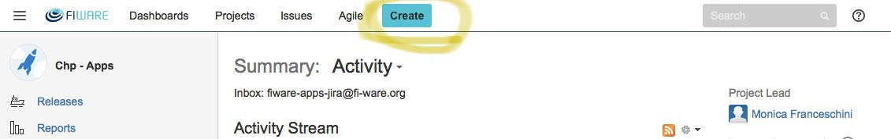

   Create an issue in JIRA

2. Fill the form

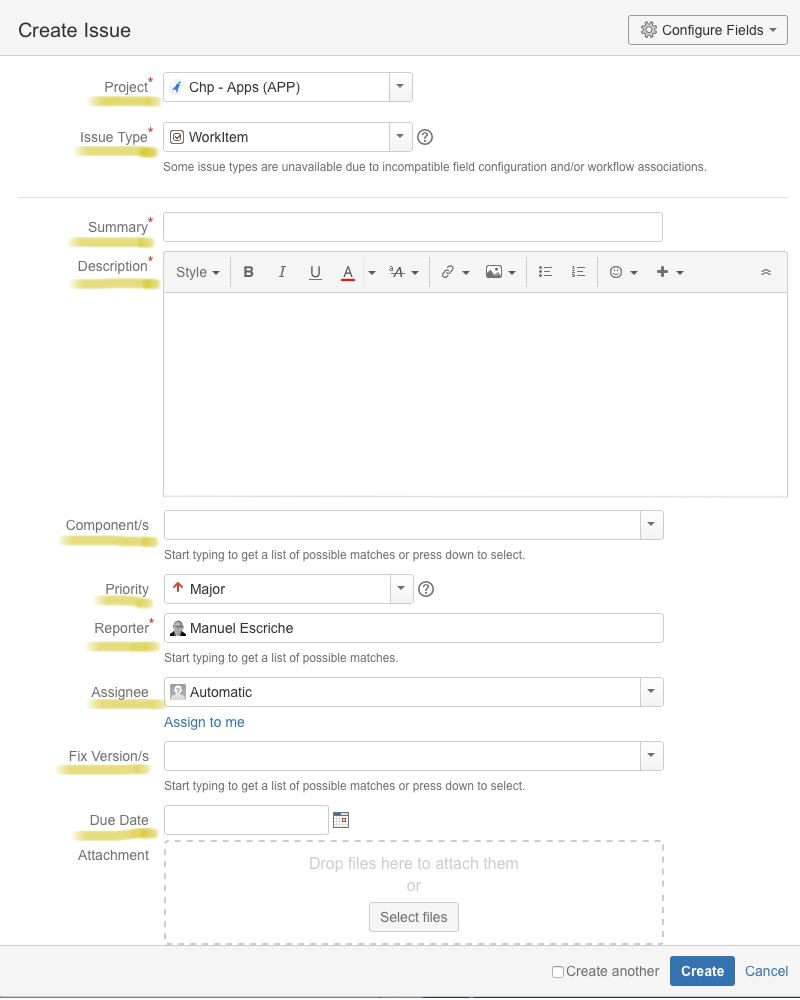

   Fill the form to create an issue

When filling in the form, take into account there's a number of mandatory fields (marked with a red asterisk)

* *Project*, identifies the tracker holding the issue. See :ref:`jira_structure`
* *Issue Type*, refers to the type of the issue we want to create: Work Item, Bug, etc. See :ref:`jira_model`
* *Summary*, it is the issue 'title', it gives an idea of the issue's content
* *Description*, it explains what is the issue about in detail
* *Components*, it refers to the components composing the tracker, however they are used as follows
   * Tech Chapters : enablers or tools
   * Lab : Nodes
   * Working Groups: conceptual structure provided by the leader.
   * Help Desk : Channels (General, Mundus, speakers, Lab, Tech, ...)
   * Coaches Help Desk: Accelerators
* *Priority*, from highest to lowest: (Blocker, Critical, Major, Minor and Trivial). By default Major is assigned.
  This field is used by the backlog management website to present blocked and impeded issues.
  Blocker is used when the issue is preventing progress somewhere else .
* *Reporter*, it refers to the user creating the issue. For incoming issues in the help desk whose sender is unknown, FW External User is used.
* *Fix Version*, it refers to the time slot: release or sprint the issue is resolved on.
  This field is used in the backlog management website to present forgotten issues
* *Due Date*, it refers to the deadline the issue is planned for.
  This field is used in the backlog management website to present upcoming and overdue issues.

By email
""""""""
Alternatively issues can be created by email; by sending an email to the corresponding tracker inbox an issue is created.
Inboxes are available in the column Inbox at :ref:`jira_structure`

The email subject becomes the issue summary, and the email body its description.
Additionally JIRA tries to identify the reporter by searching in its data base. Other fields aren't mapped.

Evolve issue's status
^^^^^^^^^^^^^^^^^^^^^^^^^
Once the issue has been created, when assigned a notification (email) is sent so that the 'owner' become aware of its existence.
The assignee proceeds to update its status in its corresponding workflow, see :ref:`jira_workflows`.

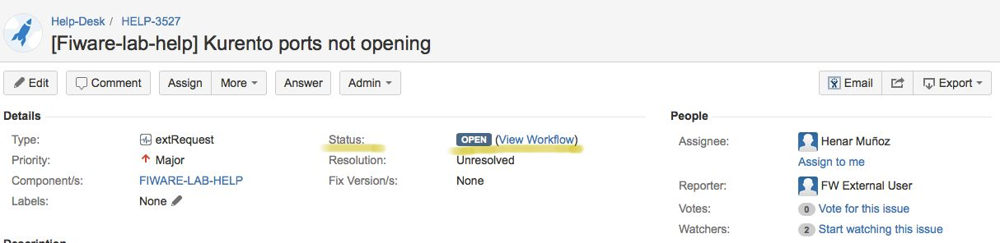

   Issue's status

Any change in the issues' information causes a notification to be sent to all issues statkeholders: reporter, watchers, assignee

.. _jira_issue_component_modify:

Modify issue's component
^^^^^^^^^^^^^^^^^^^^^^^^^^^^

You simply change the issue's component in the component field.
When you approach the pointer to the field, a pencil appears. By clicking on it, possible component options are offered.

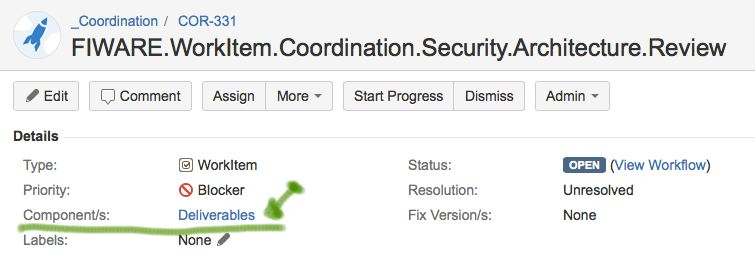

   Modify the component an issue belongs to

.. _jira_issue_comment:

Comment issue
^^^^^^^^^^^^^^^^^^^
Issues' stakeholders share additional information and clarifications about the issue by mean of adding comments on it.

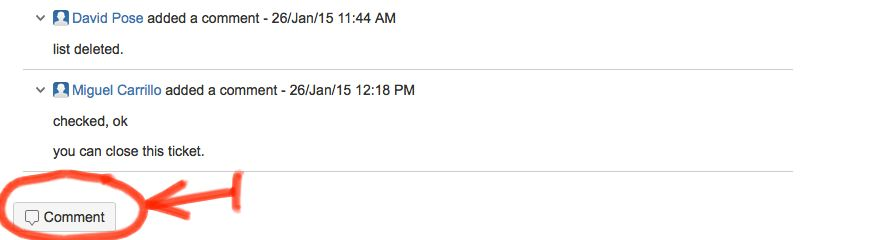

   Issues's comments

When a comment is added, all issues' stakeholders receive a notification.
Therefore comments are a powerful communication mechanism for people involved in the issue.
However **it can only be used effectively for JIRA users**.

.. _jira_email_issue:

Email issue
^^^^^^^^^^^^^^
When providing support through the help desk, most common interaction happens with external JIRA users, who don't have an account.
In these cases writing comments on the issue is not as effective as for JIRA users because notifications don't reach the external user.
Consequently there's need to email the issue to notify the sender on updates.

By exploring the help desk issue, it's possible to confirm the issue was created by an external JIRA user on the Reporter field.
And to know who the sender was by reading the last line in the description:

* [Created via e-mail received from: Sender Name <Sender Email>]

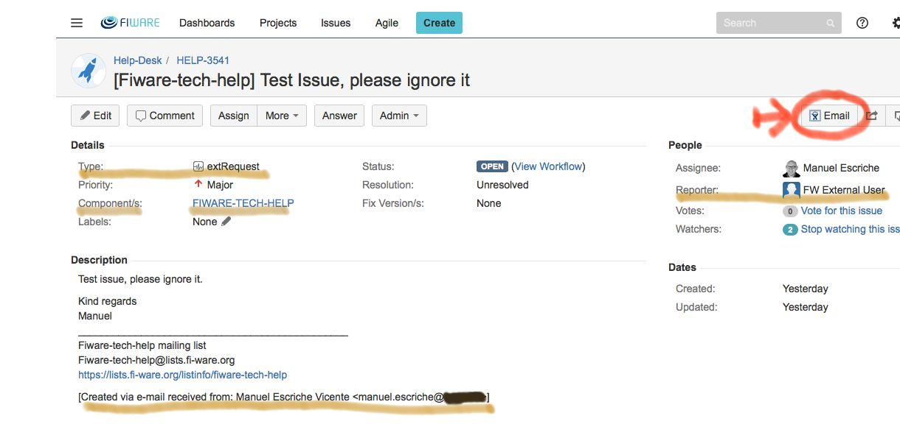

   Watching an issue in the help desk

Once you click on the Email button, you get the screen bellow, where you can copy the sender address, write the comment and send

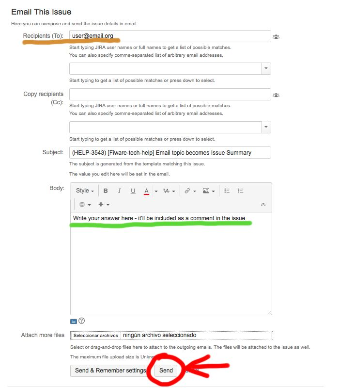

   Emailing an issue

After clicking on the send button, you can check the issue has been updated with the comment.

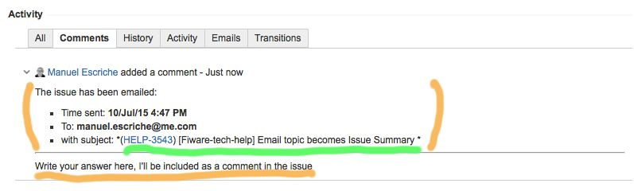

   The answer displayed as comment

Then, the external user's reply to the email is included as a comment as well

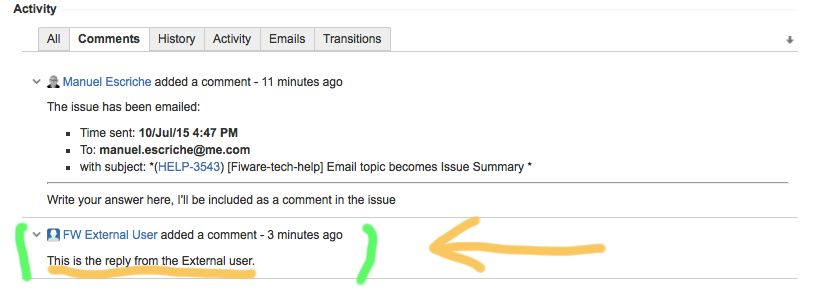

   The external user reply by email as comment

By following this dynamic it's possible to easily dialogue with the external JIRA user

.. _jira_issue_clone:

Clone  issue
^^^^^^^^^^^^^

Sometimes it's important to clone an issue. For example:

* when two or more assignees have to contribute to its resolution.
* when you want to take it from the help desk to an internal enabler's backlog
* when you want to take it from the coaches help desk to the main help desk

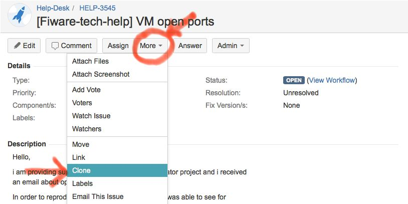

   Menu sequence to clone an issue

.. _jira_issue_move:

Move issue
^^^^^^^^^^^^^

Sometimes issues end up in the wrong tracker. In these cases there's need to move them to its proper holder tracker.

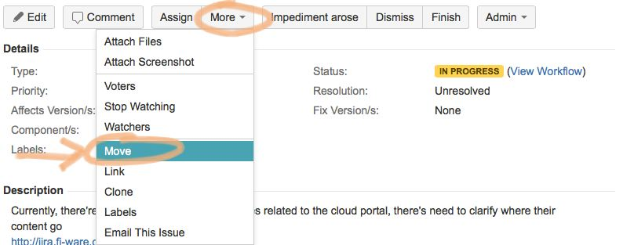

   Menu sequence to move an issue

Moving an issue requires to take a number of steps as the screen below informs:

#. Identify tracker target and issue type
#. Status when a different workflow drives the destination tracker or issue type
#. Any required mandatory field in the destination tracker
#. Confirm previous input before taking the actual move

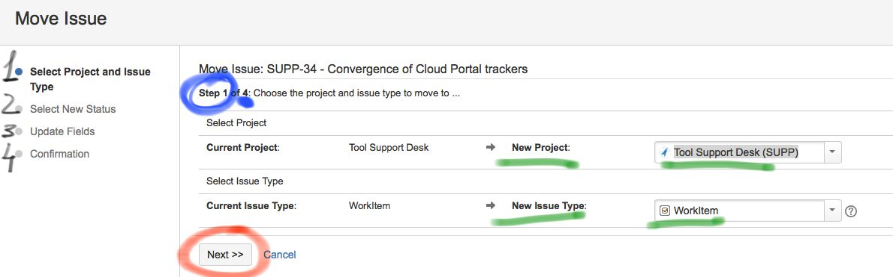

.. _jira_issue_remove:

Delete issue
^^^^^^^^^^^^^^^

Removing an issue can only be taken by your tracker administrator.
This role is normally hold by your chapter leader and/or architect.
Therefore, if you wish to remove an issue, you simple:

 #. rename it by adding DELETE or REMOVE,
 #. and re-assign it to your chapter leader, architect or scrum master.

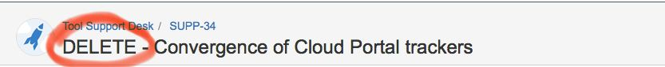

   Modify the title by adding REMOVE

The tracker administrator will remove it by following the menu sequence below:

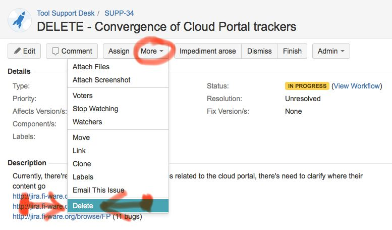

   Menu item to delete the issue

Change the issue type
^^^^^^^^^^^^^^^^^^^^^^^

Sometimes there's need to change the issue type to an issue.
To accomplish it you simple move the issue to the same tracker, by selecting the issue type you wish.
See :ref:`jira_issue_move`

.. _jira_workflows:

Workflows
---------

Any issue created in JIRA evolves according to its corresponding workflow.
It determines what status and transitions are allowed, and finally how it can be resolved.

In order to know what workflow governs a specific issue, you just click on View Workflow.

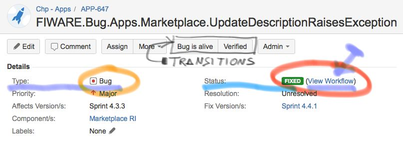

   Know issue's workflow

**Alternative Resolution Flow**

All work flows have an alternative flow used when the main flow can't be followed.

Sometimes, the request is not proper, or the dialogue is broken with insufficient input,  in those cases, while being **In dialogue (In Progress)**,
the issue can be resolved with the *Resolve* transition, which allows you to specify what resolution is applied:

* Dismissed
* Duplicate
* Incomplete
* Cannot Reproduce
* New Feature/Funcitonality

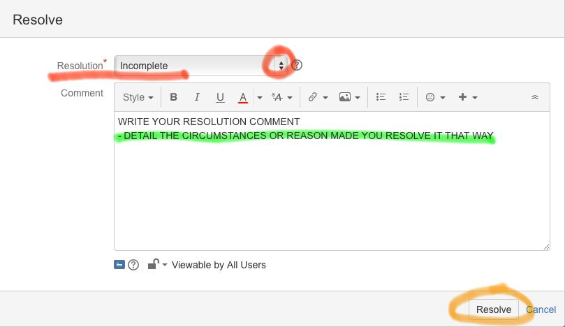

   Issue's alternative resolution

Request
^^^^^^^
This issue type and workflow has been designed for incoming issues to the help desk.

**Main Flow**

#. An incoming email to the help desk creates the issue in  **Waiting (Open)** status, meaning it awaits reaction.
#. When the help desk operator answers the issue by email (see :ref:`jira_email_issue`) and clicks on the *answer* transition, the issues' status moves to **In dialogue (In Progress)** where it should be while holding a dynamic timely information exchange.
#. Once the issue is clarified, or due action performed, it should be moved to **Answered** with the *answered* transition, awaiting for end user's confirmation before its resolution
#. After receiving users' confirmation, or some time past, the issue should be resolved, **Closed** by clicking on *finish* transition

+-----------------------------------------------------+-----------------------------------------------------------+
| Workflow diagram                                    |Workflow transitions                                       |
+=====================================================+===========================================================+
|                                                     |                                                           |
|.. figure:: _static/jira_workflow_request_graph.jpg  |.. figure:: _static/jira_workflow_request_transitions.jpg  |
|   :align: center                                    |   :align: center                                          |
|   :height: 300 px                                   |   :height: 300px                                          |
+-----------------------------------------------------+-----------------------------------------------------------+

Epic
^^^^
This issue type and workflow has been designed for the most abstract organising item in the backlog.
Epics don't have a definite time frame, and always have features as children.

**Main Flow**

#. An Epic is created for any development big topic lasting indefinite time in **To Do (Open)** status.
#. It's put **In Progress** with the *Start Development* transition when its first children start its work
#. It's moved **Closed** with *Finish* when its last children is finished

+-----------------------------------------------------+-----------------------------------------------------------+
| Workflow diagram                                    |Workflow transitions                                       |
+=====================================================+===========================================================+
|                                                     |                                                           |
|.. figure:: _static/jira_workflow_epic_graph.jpg     |.. figure:: _static/jira_workflow_epic_transitions.jpg     |
|   :align: center                                    |   :align: center                                          |
|   :height: 300 px                                   |   :height: 300px                                          |
+-----------------------------------------------------+-----------------------------------------------------------+

The Epic can *Reopen* anytime when new features appear for implementation.

Feature
^^^^^^^
Features are how we want to describe the product to the market. They are implemented in three months lasting a minor release.
Features always have user stories as children.

**Main Flow**

#. A Feature is created in **To Do (Open)** status.
#. It's put **In Progress** with the *Start Development* transition when its first children start its work
#. It's moved **Closed** with *Finish* when its last children is finished

+-----------------------------------------------------+-----------------------------------------------------------+
| Workflow diagram                                    |Workflow transitions                                       |
+=====================================================+===========================================================+
|                                                     |                                                           |
|.. figure:: _static/jira_workflow_feature_graph.jpg  |.. figure:: _static/jira_workflow_feature_transitions.jpg  |
|   :height: 300 px                                   |   :height: 300px                                          |
|   :align: center                                    |   :align: center                                          |
|                                                     |                                                           |
+-----------------------------------------------------+-----------------------------------------------------------+

User Story
^^^^^^^^^^
User Stories are concrete behaviour implemented in the component. They are implemented in a month, lasting a sprint.
User Stories have always Features as fathers.

**Main Flow**

#. A Story is created in **To Do (Open)** status.
#. It's put **In Progress** with the *Start Development* transition when it's started.
#. It's moved **Closed** with *Finish* when it is finished

+-----------------------------------------------------+-----------------------------------------------------------+
| Workflow diagram                                    |Workflow transitions                                       |
+=====================================================+===========================================================+
|                                                     |                                                           |
|.. figure:: _static/jira_workflow_story_graph.jpg    |.. figure:: _static/jira_workflow_story_transitions.jpg    |
|   :align: center                                    |   :align: center                                          |
|   :height: 300 px                                   |   :height: 300px                                          |
+-----------------------------------------------------+-----------------------------------------------------------+

Bug
^^^^
Bugs cause malfunction in the software. Whenever they are found and reported an issue of this type is created.

**Main Flow**

#. A Bug is created in **Open** status.
#. It goes to **Analysing** when the assignee starts this task and transition it with *Analysing*.
#. After understanding where the malfunction is caused, *Start Fixing* transition it to **In Progress**
#. *Fixed* brings it to **Fixed** status. It remains there for verification
#. Successful verification **Closes** the issue with *Verified*.
#. Unlike *Bug is alive* that puts it to **Rejected**, where it's move back to **In Progress** with *Review Fixing*

+-----------------------------------------------------+-----------------------------------------------------------+
| Workflow diagram                                    |Workflow transitions                                       |
+=====================================================+===========================================================+
|                                                     |                                                           |
|.. figure:: _static/jira_workflow_bug_graph.jpg      |.. figure:: _static/jira_workflow_bug_transitions.jpg      |
|   :align: center                                    |   :align: center                                          |
|   :height: 300 px                                   |   :height: 300px                                          |
+-----------------------------------------------------+-----------------------------------------------------------+

Work Item
^^^^^^^^^
Work Items are concrete items used for NON DEVELOPMENT work, like documentation, software design, analysis and deployment, etc.
Work Items doesn't require to follow any hierarchy rule.

**Main Flow**

#. A Work Item is created in **To Do (Open)** status.
#. It's put **In Progress** with the *Start Progress* transition when it's started.
#. It's moved **Closed** with *Finish* when finished

+------------------------------------------------------+------------------------------------------------------------+
| Workflow diagram                                     |Workflow transitions                                        |
+======================================================+============================================================+
|                                                      |                                                            |
|.. figure:: _static/jira_workflow_workitem_graph.jpg  |.. figure:: _static/jira_workflow_workitem_transitions.jpg  |
|   :align: center                                     |   :align: center                                           |
|   :height: 300 px                                    |   :height: 300px                                           |
+------------------------------------------------------+------------------------------------------------------------+

