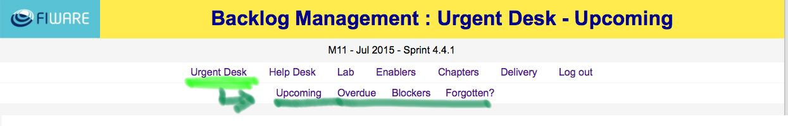

.. _urgent_desk:

Urgent Desk
-----------

The urgent desk provides several views of items needing reaction from their owners.
It takes advantage of the due date field for Upcoming and Overdue views;
the priority field is used to identify Blockers, and the status field to know which are impeded.
Finally, there's a view to display issues aged more than 100 days.

Normally the items list presented below are ordered by priority and age so that oldest blockers appear first.

Upcoming
^^^^^^^^
    It shows items whose deadlines are due in next 7 days. It helps synchronising action from all the consortium.

    .. figure:: _static/backlog_urgent_upcoming.jpg
       :align: center

Overdue
^^^^^^^^
    It shows items whose deadline wasn't met. It helps remind them until they can be addressed finally.

    .. figure:: _static/backlog_urgent_overdue.jpg
       :align: center

Blockers & Impeded
^^^^^^^^^^^^^^^^^^
    It shows items blocking others and the corresponding impeded. It helps fluid cooperation by not blocking ourselves.
    The blockers list is ordered by status and age. And the impeded list by priority and age.

    .. figure:: _static/backlog_urgent_blockers.jpg
       :align: center

**Forgotten?**
    It shows items aged more than 100 days. This list is ordered by priority and age.

    .. figure:: _static/backlog_urgent_forgotten.jpg
       :align: center

